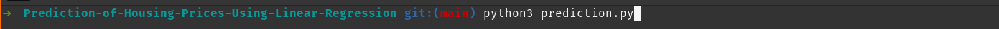
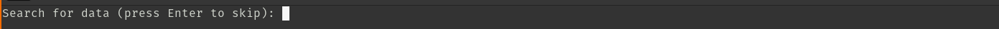
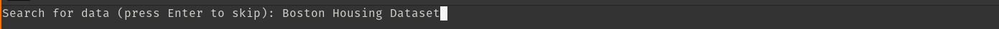
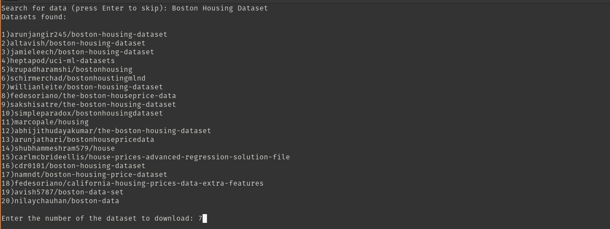
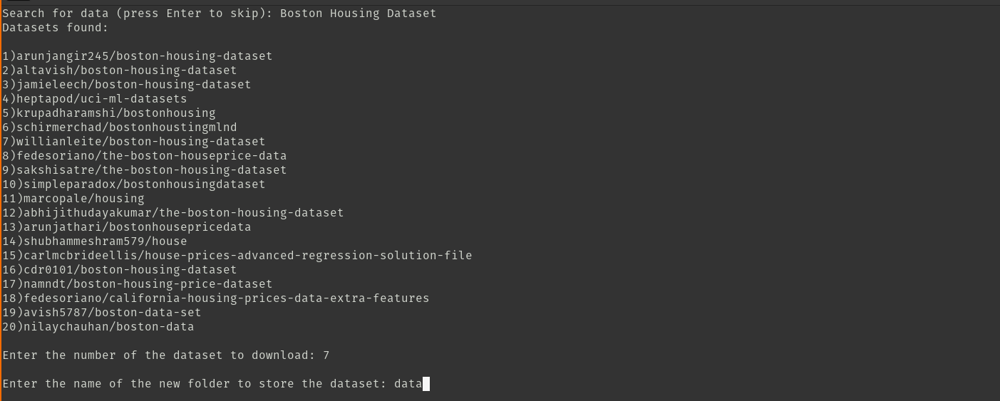
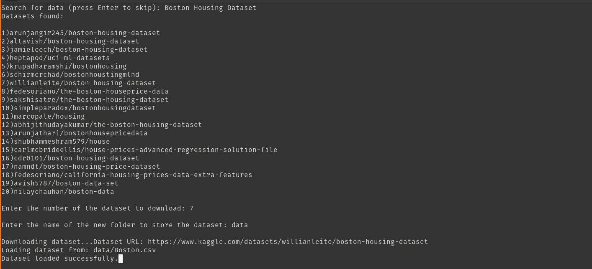
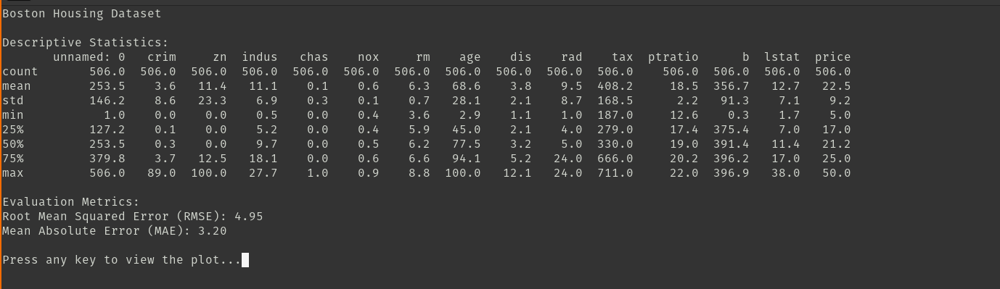
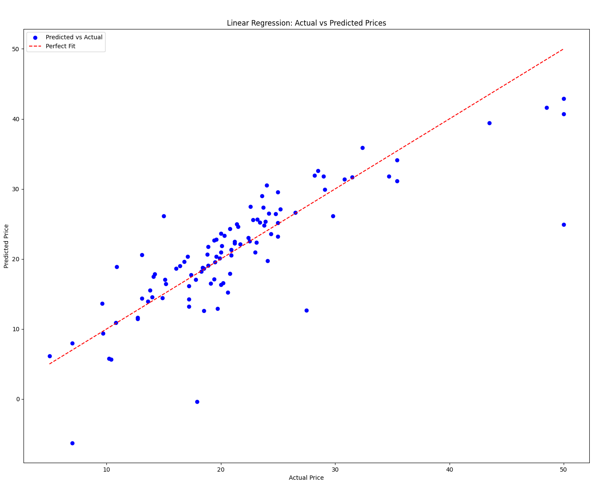

# Kaggle Dataset Fetcher and Predictor

This project provides tools to search for datasets on Kaggle, download and preprocess them, and perform predictions using a Linear Regression model. It includes interactive text-based user interfaces built with `curses`.

## Features

- Search for datasets on Kaggle interactively.
- Download datasets and automatically extract files.
- Load datasets into a pandas DataFrame and preprocess them.
- Train a Linear Regression model and evaluate it using RMSE and MAE.
- Visualize results with scatter plots.

---

## Prerequisites

1. **Python**: Python 3.7 or higher.
2. **Install Required Libraries**:
<br>
   
   ```bash
   pip install pandas numpy matplotlib scikit-learn kaggle
   ```

## Set Up Kaggle API:

- Go to Kaggle Account.
- Download the kaggle.json API token.
- Place it in ~/.kaggle/ (Linux/Mac) or %USERPROFILE%\.kaggle\ (Windows).

## File Structure
```bash
.
├── kaggle_connect.py  # Handles dataset search and download via Kaggle API.
├── prediction.py      # Performs data preprocessing, model training, and visualization.
└── README.md          # Documentation for the project.
```

## Usage

### Step 1: Search and Download a Dataset

Run the following command to search, download a kaggle dataset and prediction script:
```bash
python prediction.py
```
Or
```bash
python3 prediction.py
```
Follow the interactive prompts:

1. Enter a search term for datasets (e.g., Boston Housing Dataset).
2. Select a dataset from the list.
3. Specify a folder to store the downloaded files.

### Step 2: Train and Test a Linear Regression Model
The script:

4. Displays descriptive statistics of the data.
5. Splits the data into training and testing sets.
6. Trains a Linear Regression model and evaluates its performance.
7. Displays a scatter plot comparing actual and predicted values.

## Example Output
### Terminal Interface
**Dataset Selection**







<br>

**Model Metrics**



### Scatter Plot


## Contributions

Contributions are welcome! Feel free to submit issues or pull requests to enhance the functionality.